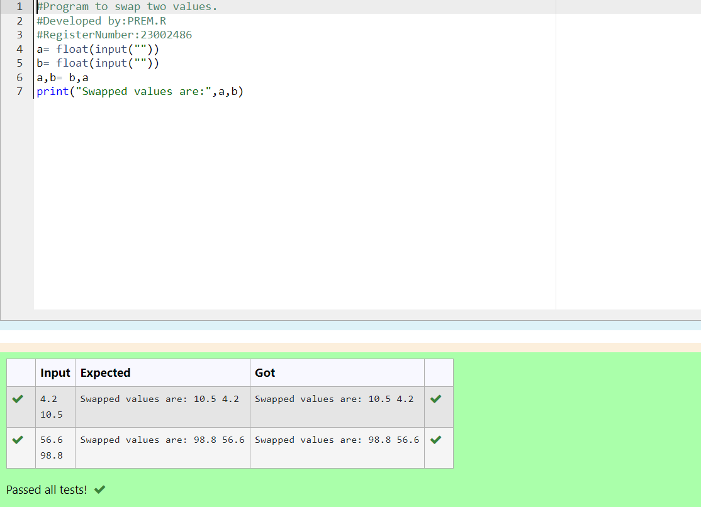

# Swapping-two-values
## AIM:
To write a python program for swapping of two values
## EQUIPEMENT'S REQUIRED: 
PC
Anaconda - Python 3.7
## ALGORITHM: 
### Step 1:
Get the two values from the user
### Step 2: 
Assign the value of second variable to a temporary variable 
### Step 3: 
Assign the value of the first variable to the second variable.
### Step 4:  
Assign the value in temporary variable to the first variable
### step 5:
print both the values it would be interchanged
### Step 6: 
End the program
## PROGRAM:
```
#Program to swap two values.
<<<<<<< HEAD
#Developed by:PRADEEP V
#RegisterNumber:23013543
a=eval(input())
b=eval(input())
a,b=b,a
print("Swapped values are:",a,b)
```
## OUTPUT:

=======
#Developed by:PREM.R 
#RegisterNumber:23002486
a= float(input(""))
b= float(input(""))
a,b= b,a
print("Swapped values are:",a,b)

```
### OUTPUT:


>>>>>>> bf2f451ee7058954f0f2c3c2235142014a3439a5


## RESULT:
Thus the swapping of two values are successfully executed


